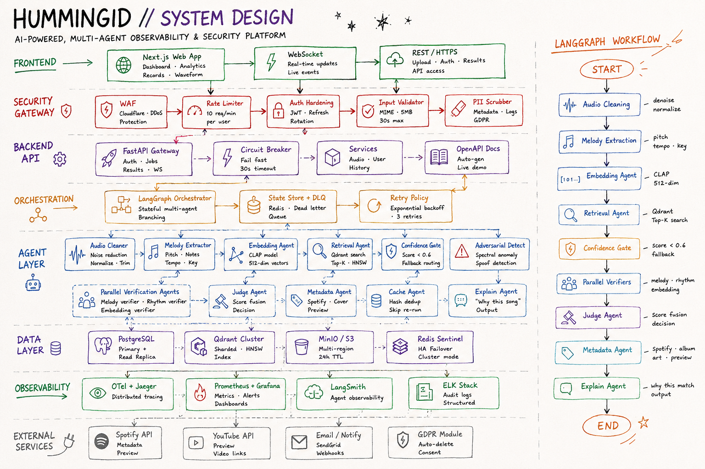

# HummingID

**AI-Powered, Multi-Agent Music Identification, Observability & Security Platform**

HummingID identifies songs from short audio clips (humming, singing, or recorded snippets) using a stateful multi-agent pipeline. A LangGraph orchestrator routes audio through cleaning, melody/embedding extraction, vector retrieval, confidence gating, parallel verification, score fusion, and an explainability stage that tells the user *why* a given match was chosen.

---

## System Design



---

## Architecture Overview

### Frontend
- **Next.js Web App** — Dashboard, analytics, records, waveform viewer
- **WebSocket** — Real-time job updates and live events
- **REST / HTTPS** — Upload, auth, results, public API access

### Security Gateway
- **WAF** — Cloudflare DDoS protection
- **Rate Limiter** — 10 req/min per user
- **Auth Hardening** — JWT with refresh-token rotation
- **Input Validator** — MIME-type checks, 5 MB / 30 s max payload
- **PII Scrubber** — Metadata & log scrubbing, GDPR-compliant

### Backend API
- **FastAPI Gateway** — Auth, jobs, results, WebSocket fan-out
- **Circuit Breaker** — Fail-fast with 30 s timeout
- **Services** — Audio, user, history
- **OpenAPI Docs** — Auto-generated, live demo

### Orchestration
- **LangGraph Orchestrator** — Stateful, branching multi-agent graph
- **State Store + DLQ** — Redis-backed state with dead-letter queue
- **Retry Policy** — Exponential backoff, 3 retries

### Agent Layer
| Agent | Role |
|---|---|
| Audio Cleaner | Noise reduction, normalization, trimming |
| Melody Extractor | Pitch, notes, tempo, key |
| Embedding Agent | CLAP model, 512-dim vectors |
| Retrieval Agent | Qdrant search, Top-K HNSW |
| Confidence Gate | Score < 0.6 → fallback routing |
| Adversarial Detect | Spectral anomaly & spoof detection |
| Parallel Verification Agents | Melody / rhythm / embedding verifiers |
| Judge Agent | Score fusion & final decision |
| Metadata Agent | Spotify cover art & preview lookup |
| Cache Agent | Hash dedup, skip re-runs |
| Explain Agent | "Why this song" output |

### Data Layer
- **PostgreSQL** — Primary + read replica
- **Qdrant Cluster** — Sharded HNSW vector index
- **MinIO / S3** — Multi-region object storage, 24 h TTL
- **Redis Sentinel** — HA failover, cluster mode

### Observability
- **OTel + Jaeger** — Distributed tracing
- **Prometheus + Grafana** — Metrics, alerts, dashboards
- **LangSmith** — Agent-level observability
- **ELK Stack** — Structured audit logs

### External Services
- **Spotify API** — Metadata & preview
- **YouTube API** — Preview video links
- **Email / Notify** — SendGrid webhooks
- **GDPR Module** — Auto-delete & consent management

---

## LangGraph Workflow

```
START
  └─► Audio Cleaning        (denoise, normalize)
        └─► Melody Extraction  (pitch, tempo, key)
              └─► Embedding Agent   (CLAP, 512-dim)
                    └─► Retrieval Agent  (Qdrant Top-K)
                          └─► Confidence Gate  (score < 0.6 → fallback)
                                └─► Parallel Verifiers (melody, rhythm, embedding)
                                      └─► Judge Agent       (score fusion)
                                            └─► Metadata Agent  (Spotify, album art)
                                                  └─► Explain Agent  (why this match)
                                                        └─► END
```

---

## Tech Stack

- **Frontend:** Next.js, React, WebSocket
- **Backend:** FastAPI, Python
- **Orchestration:** LangGraph, LangSmith
- **ML/Audio:** CLAP embeddings, melody/rhythm extraction
- **Vector DB:** Qdrant (HNSW, sharded)
- **Datastores:** PostgreSQL, Redis Sentinel, MinIO / S3
- **Observability:** OpenTelemetry, Jaeger, Prometheus, Grafana, ELK
- **Security:** Cloudflare WAF, JWT, GDPR-compliant PII scrubbing

---

## Status

Work in progress. The system design above is the target architecture.
